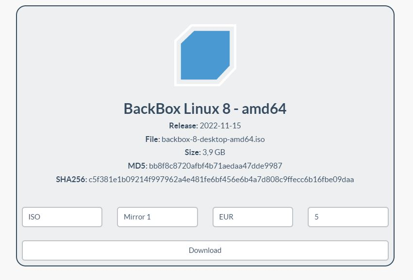
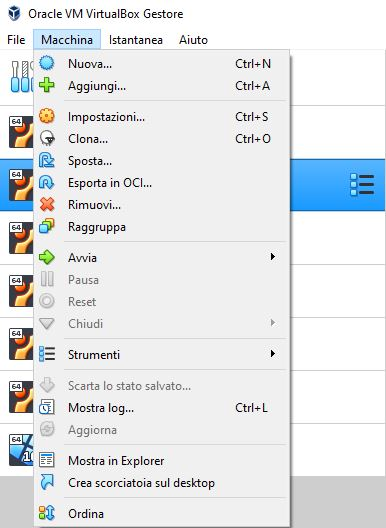
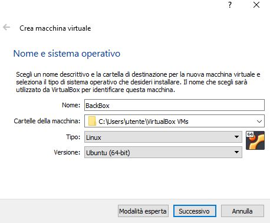
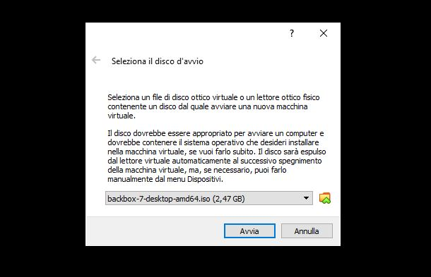
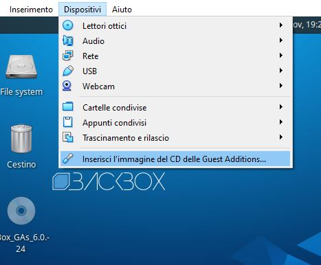
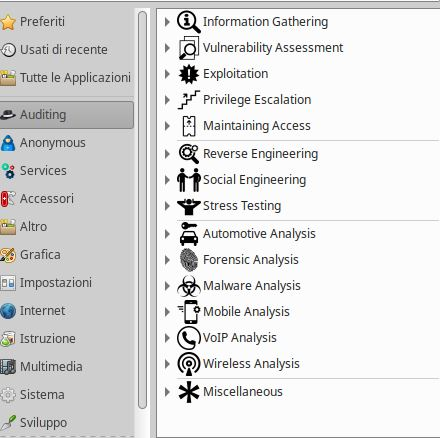

### | La migliore distro Linux per la cybersecurity?

Chiunque abbia una minima conoscenza di ciò che riguarda il mondo della sicurezza informatica sicuramente saprà che il sistema operativo cardine utilizzato dagli esperti è Linux.
Ma dire "Linux" è come dire tutto e niente considerando che sono molteplici le distribuzioni basate su Kernel Linux (Ubuntu, Kali Linux, Parrot Security e molte altre).
Dilettandomi in attività come Bug Bounty, Penetration Testing e CTF o avuto la possibilità di provare molti tipi di distribuzioni differenti, alcune molto pesanti mentre altre più light, solo nell'ultimo periodo ho scoperto una distribuzione che è un ottimo compromesso tra leggerezza e funzionalità in ambito security perchè predispone di una notevole quantità di moduli e tools preinstallati che ci rendono subito operativi, la distro di cui sto parlando è __BackBox__ derivata da Ubuntu.

Caratteristiche di _BackBox_:
- __Architettura__: x86_64
- __Derivata da__: Ubuntu
- __Prodotto in__: Italia
- __Ambiente grafico__: Xfce

### | Installazione BackBox su VirtualBox

- Installazione ISO dal sito [ufficiale](https://www.backbox.org/download/)



- Creazione di una nuova macchina virtuale, _Macchina > Nuova_



- Aggiungere le informazioni di base


- Selezionare la quantità di RAM da dedicare
- Selezionare _Crea subito un nuovo disco fisso virtuale_
- Selezionare _VDI_
- Selezionare _Allocato dinamicamente_
- Scegliere la quantità di memoria di massa da dedicare  (__> 15 GB__)
- _Crea_

A questo punto possiamo avviare la macchina virtuale e importare la ISO di BackBox che abbiamo scaricato.



Il processo di installazione del sistema operativo è molto semplice e guidato.

- Seleziona la lingua (Italiano)
- Seleziona la lingua della tastiera (Italiano)
- Seleziona "Scarica gli aggiornamenti durante l'installazione di BackBox"
- Seleziona "Cancella il disco e installa BackBox"
- Inserisci le tue informazioni personali e installa

### | Installazione delle Guest Addition su BackBox

Per completare l'installazione di BackBox è fortemente consigliato installare le Guest Addition per avere delle migliori prestazioni in termini grafica e usabilità. 

- Installazione dei pacchetti utili per compilare dei moduli kernel esterni.

```bash
sudo apt update
sudo apt install build-essential dkms linux-headers-$(uname -r)
```

- Inserimento immagine delle Guest Addition.



- Creiamo una directory per poter montare il disco.

```bash
sudo mkdir -p /mnt/cdrom
sudo mount /dev/cdrom /mnt/cdrom
```

- Avviamo lo script di installazione delle Guest Addition.

```bash
cd /mnt/cdrom
sudo sh ./VBoxLinuxAdditions.run --nox11
```

- Riavviare il sistema.

### | Conclusione

Il nostro sistema operativo è ora pronto per essere esplorato.

- Notiamo la grande quantità di categorie di tools differenti già installati sulla macchina

