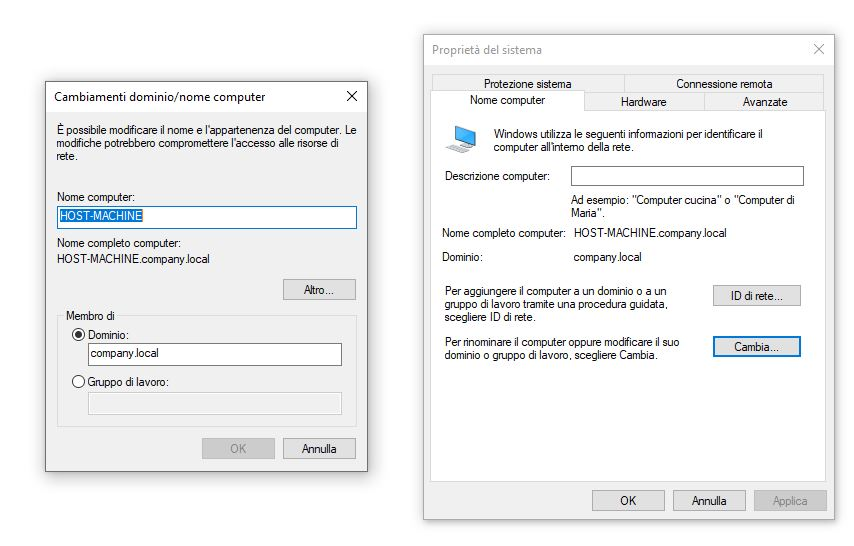

### Indice:
0. Descrizione del progetto e informazioni generali.
1. Prerequisiti.
2. Configurazione interfaccia di rete.
3. Configurazione hostname.
4. Installazione tools e configurazione Kerberos.
5. Configurazione del DNS tramite samba-tool.
6. Start del servizio AD DC.
7. Configurazione interfaccia Ethernet di Windows 10 e ingresso nel dominio.
8. Accesso come utente amministratore di dominio.

### 0. Descrizione del progetto e informazioni generali

Il progetto consiste nell'implementare un dominio Active Directory con autenticazione tramite Kerberos su Ubuntu Server e far entrare una macchina Windows 10 all'interno del dominio.

- __Domain Name__: _company.local_

L'obiettivo è quello di configurare un Domain Controller tramite il software __Samba Active Directory Domain Controller__, il quale, tramite un _wizard_, ci semplifica la configurazione del server DNS.

Come già accennato prima, utilizzeremo il servizio Kerberos per consentire agli utenti di autenticarsi all'interno del dominio e quindi accedere ad eventuali risorse condivise. 

Kerberos, per motivi di sicurezza, inserisce un parametro temporale all'interno dei pacchetti in modo tale da scartarli nei casi in cui discostano abbondantemente rispetto all'ora sul server poichè potrebbero essere stati alterati da terzi, è quindi importante utilizzare un servizio NTP (Network Time Protocol) in grado di sincronizzare gli orari su tutte le macchine della rete.

Per avere maggiori informazioni riguardo il funzionamento di Active Directory e i concetti di dominio, Domain Controller e directory consiglio di leggere questo [articolo](https://www.hackpills.it/blog/active-directory)

### 1. Prerequisiti

- Sistema operativo __Ubuntu Server 22.04.1 LTS__ installato fisicamente o tramite VirtualBox
	- Nel caso in cui si tratti di VirtualBox, è necessario configurare l'interfaccia di rete come __bridged__
- Macchina con Sistema Operativo Windows 10

### 2. Configurazione interfaccia di rete

Prima di tutto bisogna impostare un indirizzo ip statico del server, per farlo è sufficiente modificare il file di configurazione delle interfacce di rete __/etc/netplan/00-installer-config.yaml__.

```bash
sudo nano /etc/netplan/00-installer-config.yaml
```

```yaml
network:
  ethernets:
    enp0s3:
      dhcp4: no
      addresses: [192.168.1.252/24]
      gateway4: 192.168.1.1
      nameservers:
        addresses: [192.168.1.252, 8.8.8.8]
  version: 2
```

In questo caso l'interfaccia di rete è la enp0s3 ed è stata configurata in questo modo:
- disabilitazione servizio DHCP (servizio per l'assegnazione automatica degli indirizzi ip).
- Impostazione indirizzo ip statico del server _192.168.1.252_ e submask 255.255.255.0.
- Impostazione del gateway _192.168.1.1_
- Impostazione dell'indirizzo del server DNS primario _192.168.1.252_ (La macchina server stessa) e secondario _8.8.8.8_ (google Server DNS), in questo modo abbiamo comunque la possibilità di risolvere domini esterni.

Per applicare le modifiche:

```bash
sudo netplan apply
```

### 3. Configurazione hostname

La macchina server dovrà essere vista all'interno della rete con l'hostname _dc1_, quindi per impostarlo è sufficiente accedere al file __/etc/hostname__ e sostituire l'hostname presente con _dc1_:

```bash
sudo nano /etc/hostname
```

```txt
dc1
```

A questo punto inseriamo il riferimento a _dc1_ in __/etc/hosts__, in questo modo possiamo riferirci al Server Domain Controller direttamente tramite la notazione _dc1.company.local_

```bash
sudo nano /etc/hosts
```

```txt
192.168.1.252 dc1
192.168.1.252 dc1.company.local
```

Riavviamo per applicare le modifiche.

```bash
sudo reboot now
```

### 4. Installazione tools e configurazione Kerberos

I tools necessari per creare un Domain Controller Samba sono:
- __samba__: pacchetto Samba principale
- __smbclient__: tools per interagire con risorse condivise tramite protocollo smb.
- __krb5-config__: file di configurazione per Kerberos Versione 5
- __winbind__: consente l'autenticazione degli utenti Linux presso un Domain Controller

```bash
sudo apt update
sudo apt install -y samba smbclient krb5-config winbind
```

Ad un certo punto ci viene chiesto di inserire il nome del realm di KeyCloak, cioè il realm corrispondente al dominio di autenticazione in cui Kerberos è presente, solitamente coincide con il root Domain Name, in questo caso COMPANY.LOCAL.


Successivamente ci viene chiesto di inserire l'hostname del server sul quale è presente il servizio Kerberos, in questo caso è _dc1_.


Anche nel passaggio seguente è sufficiente inserire l'hostname della macchina server, _dc1_.

### 5. Configurazione del DNS tramite samba-tool

Il team di sviluppo Samba ha prodotto un software in grado si semplificare la configurazione del servizio DNS che altrimenti sarebbe stata abbastanza complessa.
Tramite samba-tool è possibile eseguire un _wizard_ che sulla base delle risposte ad alcune domande che ci vengono poste è in grado di compilare il DNS interno. 

```bash
sudo samba-tool domain provision --use-rfc2307 --interactive
```

Le informazioni da inserire sono queste:

1) __Realm__: COMPANY.LOCAL

2) __Domain__: COMPANY

3) __Server Role__: dc

4) __DNS backend__: SAMBA_INTERNAL

5) __DNS forwarder IP address__: 8.8.8.8

6) __Administrator password__: \*\*\*\*\*\*\*\*

Nella quarta voce, __SAMBA_INTERNAL___ è il modulo di configurazione del DNS interno di Samba.

Nella quinta voce, __DNS forwarder IP address__ è l'indirizzo del Server DNS da utilizzare nel momento in cui un dominio non può essere risolto all'interno della rete locale.

Nella sesta voce, la password di amministratore inserita verrà poi utilizzata dall'admin per poter accedere al dominio.

Il software ha automaticamente creato il file di configurazione smb.conf all'interno di /etc/samba.
Per consentire la massima compatibilità del servizio è buona norma impostare come versione minima di SMB la 2, considerando che la prima versione non è più supportata da Windows e Mac.
Per fare ciò modifichiamo il file __/etc/samba/smb.conf__ aggiungendo 3 direttive nel bloco global.

```txt
[global]
        dns forwarder = 8.8.8.8
        netbios name = DC1
        realm = COMPANY.LOCAL
        server role = active directory domain controller
        workgroup = COMPANY
        idmap_ldb:use rfc2307 = yes
        
        # direttive per disabilitare l'utilizzo della versione 1 di SMB
        server min protocol = SMB2_10 
        client min protocol = SMB2
        client max protocol = SMB3
```

Infine bisogna indicare l'indirizzo del server DNS all'interno del file __/etc/resolv.conf__.

```bash
sudo nano /etc/resolv.conf
```

```txt
nameserver 192.168.1.252
options edns0 trust-ad
search .
```

### 6. Start del servizio AD DC

Adesso possiamo far partire il servizio Samba AD DC che avvierà a sua volta il servizio DNS che abbiamo configurato, a tal proposito bisogna accertarsi di non avere alcun processo in esecuzione sulla porta 53.

- Per visualizzare eventuali processi attivi sulla porta 53:

```bash
sudo netstat -lnp | grep 53
```

- Per avviare il servizio:

```bash
sudo systemctl unmask samba-ad-dc
sudo systemctl start samba-ad-dc
```

- Per avere informazioni riguardo ad eventuali errori:

```bash
sudo systemctl status samba-ad-dc
```

L'output dovrebbe essere questo:


### 7. Configurazione interfaccia Ethernet di Windows 10 e ingresso nel dominio

Prima di tutto bisogna configurare staticamente l'indirizzo ip della macchina Windows 10 e impostare come indirizzo di server DNS primario quello della macchina Ubuntu Server (sulla quale è attivo anche il servizio DNS), mentre come indirizzo secondario inseriamo quello di google per consentire la risoluzione di domini esterni alla nostra rete.

-  Andare su Settings > Rete e internet


- Cliccare sulla voce Ethernet in alto
- Nella sezione _Impostazione IP_ cliccare su _Edit_ e inserire queste informazioni:


Adesso siamo pronti per far entrare la Macchina Windows 10 all'interno del dominio _company.local_.

-  Andare su Sistema > Rinomina questo PC


- Cliccare su __Cambia__ e selezionare __Dominio__. Adesso è possibile digitare il nome del dominio all'interno del quale si vuole entrare (_company.local_).



- Riavviare

Per accedere come utente _administrator_ dalla schermata di login di Windows 10, bisogna selezionare la voce _Altri utenti_ in basso a sinistra e inserire:
- username: COMPANY\\administrator
- password: <password amministratore\>
