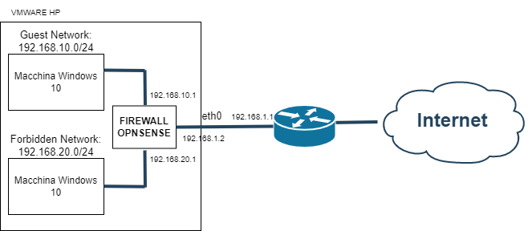

### Introduzione

Nelle realtà aziendali potrebbe verificarsi la necessità di "raggruppare" tutti gli utenti Guest all'interno di una rete isolata, in modo tale da controllare il loro traffico affinchè non possano accedere a delle risorse proibite contenute nelle altre LAN Aziendali, ad ogni modo gli utenti collegati alla rete Guest hanno comunque la possibilità di connettersi ad Internet.
I firewall consentono di gestire delle reti Guest tramite la definizione di una serie di _rules_ che controllano il traffico bloccando ogni tentativo di accesso alle altre LAN e facendo passare quello verso Internet.

Oggi vedremo come configurare una Guest LAN tramite firewall OpnSense.

### Informazioni sul setup dell'ambiente

Per la creazione delle due reti locali (LAN Guest e LAN Riservata) ho utilizzato __VMware__ che mi consente di creare due reti interne separate (GuestNET, ForbiddenNET) corrispondenti a due interfacce di rete distinte del firewall OpnSense, ho inoltre utilizzato una interfaccia di rete in bridge verso la NIC fisica dell'host e l'ho assegnata alla WAN di OpnSense. Infine ho installato due macchine Windows 10, una per la rete riservata ed un'altra per testare la rete Guest. In tutto ho installato 3 macchine virtuali, due con windows 10 ed una con sistema operativo OpnSense. 
Su OpnSense ho configurato 3 interfacce:
- __WAN__: 192.168.1.2/24
- __ForbiddenNET__: 192.168.20.1/24
- __GuestNET__: 192.168.10.1/24

Questo è lo schema corrispondente:

- Dalla rete _Guest_ deve essere possibile accedere ad internet
- Dalla rete _Guest_ non deve essere possibile accedere alle risorse della rete _Forbidden_ e al pannello di controllo del firewall (192.168.10.1)
- Dalla rete _Forbidden_ deve essere possibile accedere alla rete _Guest_, al pannello di controllo del firewall e ad internet

### Configurazione del firewall

Adesso dobbiamo tradurre le regole pecedentemente descritte in _rules_ di tipo _Pass_ e _Block_.

1) Accedere al pannello di controllo di opnsense dalla macchina contenuta nella _Forbidden Network_ tramite l'indirizzo https://192.168.20.1

2) Selezionare _Firewall > _Rules_ > _GuestNET_

3) Aggiungere regola per bloccare il traffico da qualunque sorgente della GuestNET verso ogni destinazione nella ForbiddenNET

I campi da modificare sono questi:
- __Action__: Block
- __Direction__: in
- __Source__: GuestNET net
- __Destination__: ForbiddenNET net

4) Aggiungere regola per bloccare il traffico da qualunque sorgente della GuestNET verso l'indirizzo per accedere al pannello di controllo del firewall

I campi da modificare sono questi:
- __Action__: Block
- __Direction__: in
- __Source__: GuestNET net
- __Destination__: GuestNET address (192.168.10.1)

5) Se le due precedenti regole non fanno match, allora è possibile far passare il traffico da qualunque sorgente verso qualunque destinazione, per consentire questo aggiungiamo un'ultima _rule_.

I campi da modificare sono questi:
- __Action__: Pass
- __Direction__: in
- __Source__: Any
- __Destination__: Any

Infine dovremmo trovarci in una situazione di questo tipo:

### Conclusione

Tramite la definizione di tre semplici regole siamo riusciti a raggiungere l'obiettivo che c'eravano prefissati, ovviamente questo è il minimo necessario e potremmo aggiungere anche altre regole di tipo _Pass_ prima delle _Block_ per consentire al traffico di raggiungere un __Captive Portal__ di benvenuto oppure abilitare il __DNS Forwarding__ solo sulla porta 53 e così via.
Come possiamo notare OpnSense è uno strumento veramente completo, intuitivo e molto professionale.