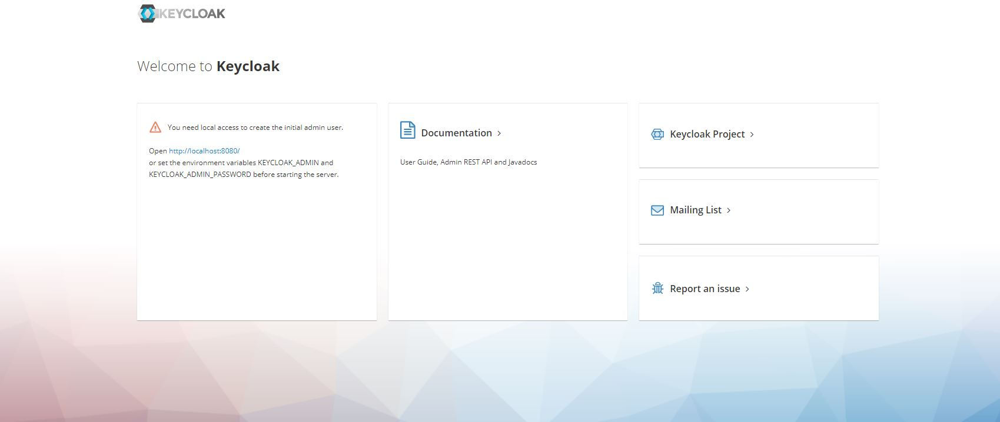
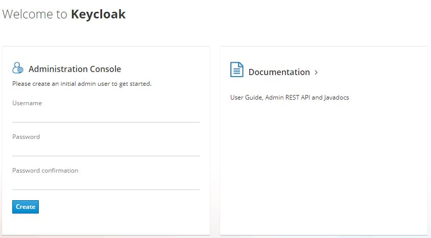

### Cos'è KeyCloak?
KeyCloak è un servizio che fornisce una serie di strumenti utili per incrementare la sicurezza delle applicazioni che vengono rese disponibili in rete. In particolare KeyCloak consente di attuare una serie di misure volte a gestire utenti, identità ed accessi.

### Caratteristiche principali di KeyCloak

#### Single Sign-On
KeyCloak è uno strumento che offre allo sviluppatore la possibilità di integrare una fase di autenticazione indipendente dalle singole applicazioni. 

In pratica le funzionalità di Single-Sign On di KeyCloak forniscono un form di autenticazione comune tra più applicazioni, in modo tale che il singolo login di un utente valga per ognuna di esse.

#### User Federation
KeyCloak consente di immagazzinare e gestire utenti. Spesso, in situazioni reali, si dispone già di una serie di utenti, magari appartenenti ad un dominio aziendale e immagazzinati all'interno di una LDAP Directory, a tal proposito KeyCloak offre la possibilità di sincronizzare gli utenti appartenenti ad un realm con quelli presenti all'interno di un dominio AD.

#### Identity Provider supportati:

##### Social Login (OpenID)
KeyCloak ti consente di aggiungere alle tue applicazioni la possibilità di loggare tramite account corrispondenti ad altre piattaforme (Google, Facebook, ...), risparmiando al singolo utente la creazione di un nuovo account. Inoltre è anche possibile abilitare il login a tutti gli utenti registrati all'interno di uno specifico realm di keycloak, questa è una buona soluzione nel momento in cui si vuole consentire l'accesso all'applicazione a tutti gli utenti presenti in un dominio Active Directory e sincronizzati con il realm.

Il protocollo di autenticazione che viene utilizzato è OpenID che si basa sulla generazione di un Identity Token ed un Access Token, entrambi vengono forniti all'applicazione e identificano l'utente.

- _Identity Token_ contiene informazioni sull'utente tipo username, email, ecc...
- _Access Token_ contiene informazioni sul ruolo dell'utente all'interno dell'applicazione e quindi determina a quali risorse può accedere.

##### SAML 2.0
SAML è un ulteriore protocollo di autenticazione simile a OpenID ma più antico e maturo, questo si basa sulla generazione di un documento XML che verrà inviato all'applicazione in seguito all'autenticazione. 
Anche in questo caso il file XML contiene attributi generali sull'utente e varie informazioni d'accesso, queste consentono all'applicazione finale di determinare quali sono le operazioni che l'utente può effettuare e a quali risorse può accedere.


### Installazione su Ubuntu 22.04.1 LTS 

- Aggiornamento del sistema.
```bash
sudo apt update
```

- Installazione JDK e JRE per poter eseguire applicazioni JAVA.
```bash
sudo apt install default-jdk
sudo apt install default-jre
```

- Scaricamento ed estrazione del pacchetto KeyCloak direttamente dal repository GitHub
```bash
wget https://github.com/keycloak/keycloak/releases/download/<VERSION>/keycloak-<VERSION>.tar.gz
tar -xvf keycloak-<VERSION>.tar.gz 
mv keycloak-<VERSION> /opt/keycloak/
```

- Spostamento di KeyCloak in _/opt/_
```bash
wget https://github.com/keycloak/keycloak/releases/download/19.0.3/keycloak-<VERSION>.tar.gz
tar -xvf keycloak-<VERSION>.tar.gz 
mv keycloak-<VERSION> /opt/keycloak/
```

### Come iniziare a lavorare con KeyCloak Server

#### Avvio modalità development (Sviluppo)
La modalità _development_ è utile per gli utenti che stanno testando KeyCloak per la prima volta e quindi hanno bisogno di una strada veloce per attuare delle configurazioni di base.

Per startare il servizio in modalità _development_:

```bash
bin/kc.sh start-dev --http-port=8080
```


Adesso il servizio è raggiungibile all'indirizzo http://server-ip:8080.



In modalità _development_ è possibile accedere al servizio tramite protocollo HTTP, questo consente di essere subito operativi considerando che non è necessario generare chiavi e certificati, come invece accade con l'HTTPS.

#### Avvio modalità production (Produzione)
La modalità _production_ è necessaria nel momento in cui il prodotto viene inserito all'interno di un ambiente di produzione in cui la sicurezza del sistema è di fondamentale importanza.

A tal proposito ci sono una serie di proprietà che "forzano" l'utilizzo di misure di sicurezza necessarie per eseguire il deployment.

Ad esempio:
- HTTP è disabilitato.
- Bisogna configurare HTTPS/TLS per far partire il servizio.
- Bisogna configurare un hostname
- Bisogna configurare un hostname per l'admin

Per startare il servizio in modalità _production_:

```bash
bin/kc.sh build
bin/kc.sh start \
--hostname=example \
--hostname-admin-url=https://example.it \
--https-certificate-file=/etc/ssl/certs/public.crt \
--https-certificate-key-file=/etc/ssl/private/private.key
```

Le stesse informazioni possono essere fornite anche attraverso il file di configurazione di KeyCloak che si trova in /opt/keycloak/conf/keycloak.conf, in questo modo è possibile evitare di inserirle ogni volta come opzioni del comando _start_.

Come possiamo notare, per attivare il protocollo HTTPS,  è necessario fornire un certificato pubblico e una chiave privata.
Il software __OpenSSL__ ci da la possibilità di generare e firmare una coppia di chiavi autonomamente, tramite un singolo comando:

```bash
sudo openssl req -x509 -nodes -days 365 -newkey rsa:2048 -keyout /etc/ssl/private/private.key -out /etc/ssl/certs/public.crt
```

#### Creazione utente admin principale

Ci sono due metodi per creare un utente admin di base in modo tale da poter accedere una prima volta al portale.

1) Da riga di comando impostando il valore di due variabili d'ambiente
```bash
export KEYCLOAK_ADMIN=<username>
export KEYCLOAK_ADMIN_PASSWORD=<password>
bin/kc.[sh|bat] start-dev
```

2) Tramite la homepage di KeyCloak in ascolto sulla porta 8080 del __localhost__, il form di creazione dell'account di admin verrà mostrato solo se si accede al servizio tramite http://localhost:8080.

Per quanto riguarda il secondo metodo potrebbe venire in mente di utilizzare un'altra macchina nella rete e collegarsi al servizio tramite http://server-ip:8080, questa soluzione non può funzionare considerando che il form di registrazione viene visualizzato SOLO se si accede direttamente dalla macchina server tramite __localhost__.


A questo punto è chiaro che la situazione si complica nel momento in cui KeyCloak è hostato su una macchina Server Linux che non possiede GUI e di conseguenza non è possibile sfruttare il browser, in questo caso si può agirare il problema utilizzando un piccolo trick con la connessione SSH.

```bash
ssh <username>@<server-ip> -L8080:localhost:8080
```

Questo comando genera un proxy in ascolto sulla nostra macchina locale sulla porta 8080 (-L8080) e tutto il traffico generato su questa porta, viene inviato sulla macchina server remota esattamente su localhost:8080. Ora ci basterà aprire il browser della macchina locale e digitare http://localhost:8080 per poter visualizzare il form di registrazione dell'utente admin, come se fossimo realmente sulla macchina server.



### RIFERIMENTI

- <https://www.keycloak.org/docs/latest/securing_apps/#supported-protocols>
- <https://www.keycloak.org/server/configuration>
- <https://www.keycloak.org/server/enabletls>
- <https://major.io/2007/08/02/generate-self-signed-certificate-and-key-in-one-line/>
