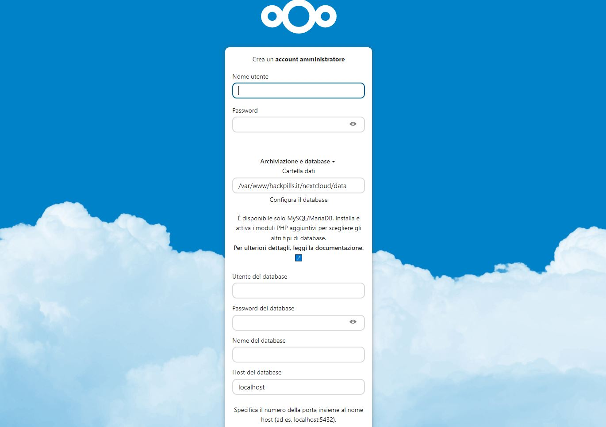
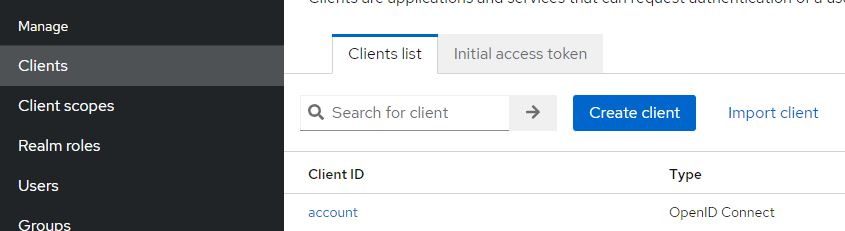
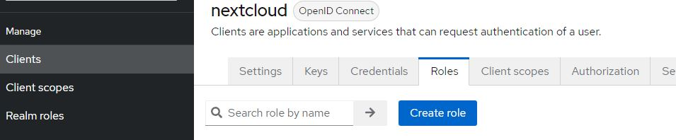
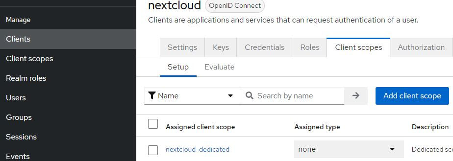
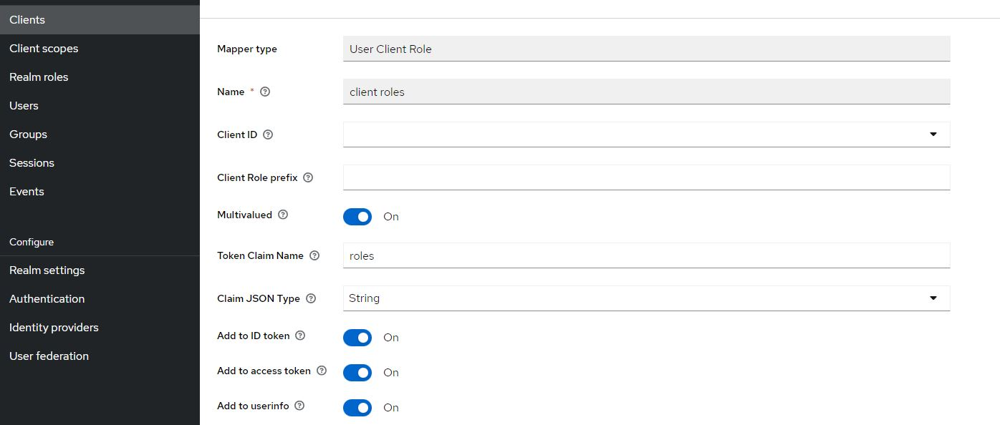
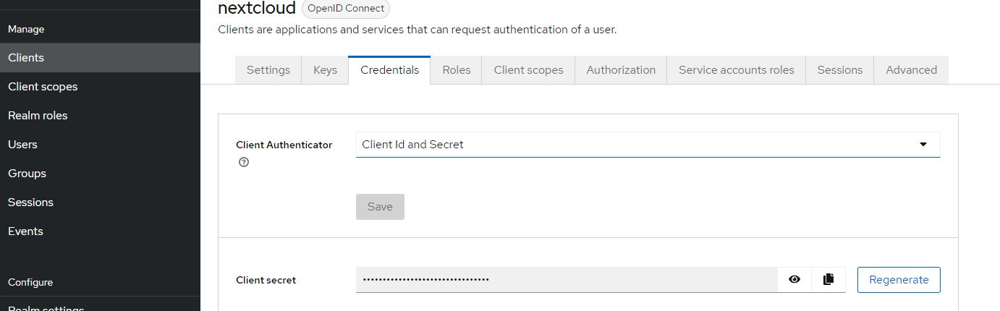
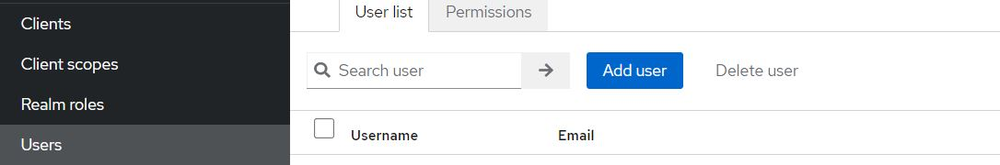
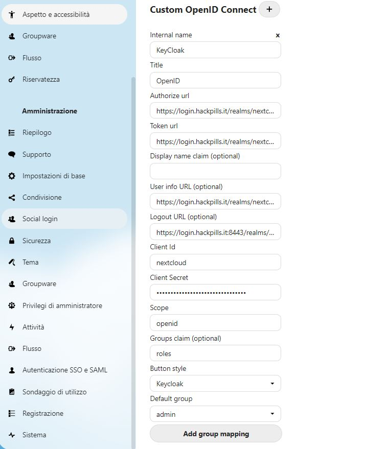
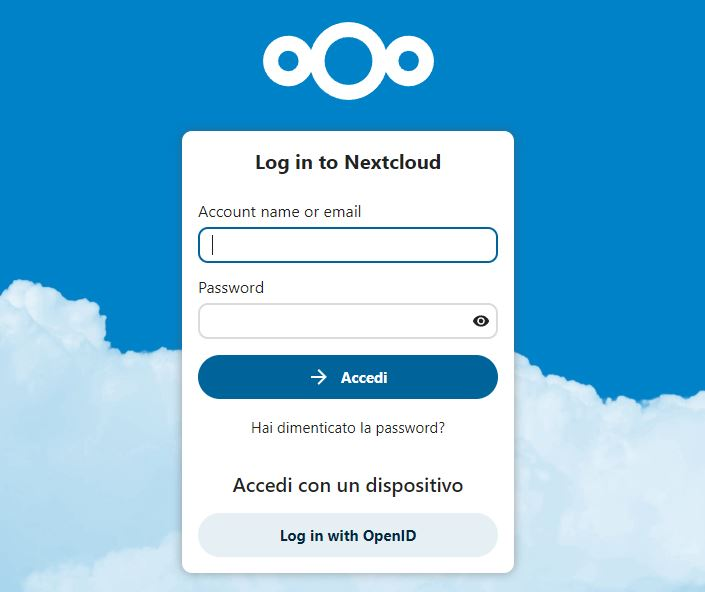

### Indice:
0. Descrizione del progetto
1. Prerequisiti
2. Installazione di Grav CMS
3. Installazione di NextCloud Server
4. Installazione di KeyCloak
5. Configurazione dell'autenticazione OpenID 
	- Configurazione lato KeyCloak
	- Configurazione lato NextCloud

### Descrizione del progetto:

Il progetto consiste nell'hostare tre web application su un server, per renderle disponibili sulla rete. L'obiettivo è quello di servire le applicazioni in corrispondenza di questi domini.
- __Grav Blog__:  __https://blog.hackpills.it__
- __NextCloud__: __https://nextcloud.hackpills.it__
- __KeyCloak__: __https://login.hackpills.it__

L'accesso al blog dovrà essere consentito a tutti mentre insieme a NextCloud sarà necessario installare e configurare l'applicazione KeyCloak, la quale fornisce un servizio di autenticazione sicuro di tipo OpenID basato sulla generazione di token JWT (per avere maggiori informazioni riguardo KeyCloak e il funzionamento del protocollo OpenID visita questo [articolo](https://www.hackpills.it/blog/come-iniziare-a-lavorare-con-keycloak)).  Adesso vediamo più in dettaglio i requisiti necessari per lo sviluppo del progetto.

### Prerequisiti:

- Sistema operativo Ubuntu Server (22.04.1 LTS) installato fisicamente o tramite VirtualBox
	- Nel caso in cui si tratti di VirtualBox, è necessario configurare l'interfaccia di rete come __bridged__
- Conoscenza di NGINX
- Conoscenza del protocollo di autenticazione OpenID
- Conoscenza di base del servizio KeyCloak
- Creazione della directory che dovrà contenere le applicazioni Grav CMS e NextCloud, è buona norma rinominare la root directory con il nome del dominio.

```bash
mkdir /var/www/hackpills.it
```

- Installazione di NGINX
- Registrazione domain e subdomain all'interno di _/etc/hosts_:

```bash
<SERVER IP> hackpills.it
<SERVER IP> login.hackpills.it
<SERVER IP> blog.hackpills.it
<SERVER IP> nextcloud.hackpills.it
```

#### Installazione di PHP e PHP-FPM

- Installazione di tutti i moduli php necessari

```bash
sudo apt update
sudo apt install php8.1-fpm php8.1-common php8.1-mysql php8.1-xml php8.1-xmlrpc php8.1-curl php8.1-gd php8.1-imagick php8.1-cli php8.1-dev php8.1-imap php8.1-mbstring php8.1-soap php8.1-zip php8.1-bcmath -y
```

### 1. Installazione e configurazione di Grav CMS:

- Download di [Grav](https://getgrav.org/downloads) ed estrazione all'interno della root directory appena creata.

```bash
cd ~
wget https://getgrav.org/download/core/grav/latest
unzip latest -d /var/www/hackpills.it/
```

All'interno di _/etc/nginx/sites-available_ creiamo il file di configurazione di Grav che dovrà contenere due blocchi _server_:

```bash
sudo nano /etc/nginx/sites-available/grav.conf
```

- Blocco _server_ in ascolto sulla porta 80 (con protocollo http) che forza il redirect verso il blocco server in ascolto sulla porta 443 (con protocollo https). In sostanza viene forzato l'utilizzo di https, questa tecnica è stata utilizzata anche nei prossimi file di configurazione che vedremo.

```nginx
server{
        listen 80;
        server_name blog.hackpills.it;
		return 301 https://$server_name$request_uri;
}
```

- Blocco _server_ in ascolto sulla porta 443 (con protocollo https) in grado di servire l'applicazione Grav passando per il server proxy php-fpm, il quale consente di gestire il carico di richieste in maniera efficiente.

```nginx
server{
	listen 443 ssl http2;
	server_name blog.hackpills.it;
	root /var/www/hackpills.it/grav;

	ssl_certificate /etc/ssl/certs/blog.hackpills.it.crt;
	ssl_certificate_key /etc/ssl/private/blog.hackpills.it.key;

	index index.php;

	location / {
		try_files $uri /$uri /index.php;
	}

	location ~ \.php$ {
		fastcgi_pass 127.0.0.1:9000;

		fastcgi_param HTTPS on;
		fastcgi_split_path_info ^(.+\.php)(/.+)$;
		fastcgi_index index.php;
		include fastcgi_params;
		fastcgi_param SCRIPT_FILENAME $document_root/$fastcgi_script_name;
	}
}
```

- Ora creiamo un link simbolico in _sites-enabled_ verso questo file di configurazione:

```bash
sudo ln -s /etc/nginx/sites-available/grav.conf /etc/nginx/sites-enabled/
```

- Riavviare NGINX

Adesso puoi raggiungere l'applicazione Grav tramite l'indirizzo __https://blog.hackpills.it__.

### 2. Installazione di NextCloud Server:

- Download ed estrazione dell'applicazione [NextCloud](https://download.nextcloud.com/server/releases/) all'interno della webroot

```bash
cd ~
wget https://download.nextcloud.com/server/releases/latest.tar.bz2
tar -xvf latest.tar.bz2 -C /var/www/hackpills.it
```

- Installazione di MariaDB

```bash
sudo apt install mariadb-server
```

- Start del DBMS

```bash
sudo /etc/init.d/mariadb start
```

A questo punto bisogna creare tramite MariaDB un database _nextcloud_ e un utente _admin_ di base per poter loggare per la prima volta all'interno dell'applicazione.

```bash
sudo mariadb -u root -p

CREATE USER 'username'@'localhost' IDENTIFIED BY 'password';
CREATE DATABASE IF NOT EXISTS nextcloud CHARACTER SET utf8mb4 COLLATE utf8mb4_general_ci;
GRANT ALL PRIVILEGES ON nextcloud.* TO 'username'@'localhost';
FLUSH PRIVILEGES;
```

All'interno di _/etc/nginx/sites-available_ creiamo il file di configurazione di NextCloud, è possibile trovare un prototipo del file di configurazione direttamente sul sito ufficiale di [nextcloud](https://docs.nextcloud.com/server/latest/admin_manual/installation/nginx.html):

```bash
sudo nano /etc/nginx/sites-available/nextcloud.conf
```

Qui sotto trovate il file di configurazione di nextcloud, con https abilitato. Ho evitato di riportare le parti che rimangono invariate rispetto al prototipo presente sul sito ufficiale.

```nginx
upstream php-handler {
    server 127.0.0.1:9000;
}

map $arg_v $asset_immutable {
    "" "";
    default "immutable";
}


server {
    listen 80;
    listen [::]:80;
    server_name nextcloud.hackpills.it;
    server_tokens off;
    return 301 https://$server_name$request_uri;
}

server {
    listen 443      ssl http2;
    listen [::]:443 ssl http2;
    server_name nextcloud.hackpills.it;

    root /var/www/hackpills.it/nextcloud;

	ssl_certificate /etc/ssl/certs/cloud.hackpills.it.crt;
    ssl_certificate_key /etc/ssl/private/cloud.hackpills.it.key;
    server_tokens off;
	
	. . .
}
```

- Ora creiamo un link simbolico in _sites-enabled_ verso questo file di configurazione:

```bash
sudo ln -s /etc/nginx/sites-available/nextcloud.conf /etc/nginx/sites-enabled/
```

- Riavviare NGINX

A questo punto possiamo accedere al servizio via browser all'indirizzo __https://nextcloud.hackpills.it__.

Al primo accesso ci verrà chiesto di inserire delle informazioni fondamentali riguardo l'account di amministratore e il database per poi completare l'installazione di NextCloud.

- La pagina dovrebbe assomigliare a questa:



Per poter accedere alla dashboard completa e quindi usufruire del servizio appena installato è necessario aggiungere il dominio _nextcloud.hackpills.it_ tra i "trusted_domains" presenti nel file /var/www/hackpills.it/nextcloud/config/config.php.

```php
<?php
$CONFIG = array (
  'instanceid' => 'oc9viezan27a',
  'passwordsalt' => 'xxx',
  'secret' => 'xxx',
  'trusted_domains' =>
  array (
    0 => 'nextcloud.hackpills.it',
  ),
  'datadirectory' => '/var/www/hackpills.it/nextcloud/data',
  'dbtype' => 'mysql',
  'version' => '25.0.0.18',
  'overwrite.cli.url' => 'https://nextcloud.hackpills.it',
  'dbname' => 'nextcloud',
  'dbhost' => 'localhost',
  'dbport' => '',
  'dbtableprefix' => 'oc_',
  'mysql.utf8mb4' => true,
  'dbuser' => 'xxx',
  'dbpassword' => 'xxx',
  'installed' => true,
);
```

### 3. Installazione di KeyCloak

- Per installare KeyCloak inviamo questi comandi, notiamo anche l'installazione di jdk e jre che consentono l'utilizzo di java:
```bash
sudo apt update
sudo apt install default-jdk
sudo apt install default-jre
cd ~
wget https://github.com/keycloak/keycloak/releases/download/<VERSION>/keycloak-<VERSION>.tar.gz
tar -xvf keycloak-<VERSION>.tar.gz
mv keycloak-<VERSION> /opt/keycloak/
```

- Creiamo l'utente admin iniziale per poter accedere al servizio la prima volta e startiamo il servizio in modalità sviluppo (_development_), in questo modo possiamo testare il login come amministratore all'url __http://hackpills.it:4444__.

```bash
export KEYCLOAK_ADMIN=<username>
export KEYCLOAK_ADMIN_PASSWORD=<password>
bin/kc.sh start-dev --http-port=4444
```

- Adesso startiamo il servizio in modalità production in modo tale da abilitare il protocollo https.

```bash
bin/kc.sh build
bin/kc.sh start \
--hostname=login.hackpills.it \
--hostname-admin-url=https://login.hackpills.it/ \
--https-certificate-file=/etc/ssl/certs/login.hackpills.it.crt \
--https-certificate-key-file=/etc/ssl/private/login.hackpills.it.key
```

Adesso possiamo raggiungere KeyCloak tramite l'indirizzo:
- __https://hackpills.it:8443__

All'interno di _/etc/nginx/sites-available_ creiamo un file di configurazione per KeyCloak in modo tale da poter raggiungere il servizio senza specificare la porta tramite l'url __https://login.hackpills.it/__:

```bash
sudo nano /etc/nginx/sites-available/keycloak.conf
```

```nginx
server{
	listen 80;
	server_name login.hackpills.it;
	return 301 https://$server_name$request_uri;
}

server {
    listen 443 ssl http2;

    server_name login.hackpills.it;

    ssl_certificate /etc/ssl/certs/login.hackpills.it.crt;
    ssl_certificate_key /etc/ssl/private/login.hackpills.it.key;

    proxy_set_header X-Forwarded-For $proxy_protocol_addr;
    proxy_set_header X-Forwarded-Proto $scheme;
    proxy_set_header Host $host;

    location / {
      proxy_pass https://hackpills.it:8443;
    }
 }
```

- Ora creiamo un link simbolico in _sites-enabled_ verso questo file di configurazione:

```bash
sudo ln -s /etc/nginx/sites-available/keycloak.conf /etc/nginx/sites-enabled/
```

- Riavviare NGINX

### 4. Configurazione dell'autenticazione OpenID 

#### Configurazione lato KeyCloak:

1) Crea un nuovo realm e chiamalo _nextcloud_

2) Crea un nuovo client



- ClientID: nextcloud
- abilita Client Authentication

3) Crea un nuovo Role chiamato _admin_ 



4) Vai su Client Scope

- clicca su _nextcloud-dedicated_ e vai su Mappers
- Add Mapper > By Configuration > User Client Role



Questo mapper assicura che gli user roles siano contenuti all'interno del Token JWT.

- Apri il tab Scope e disabilita _Full Scope Allowed_

5) Copia la password segreta dal tab Credentials del client _nextcloud_ e tienila a portata di mano in un file di testo:



6) Crea un utente nel realm _nextcloud_ che possa poi accedere al servizio NextCloud tramite autenticazione OpenID.

- Users > Add Users > Inserisci le informazioni ed imposta una password



7) In Clients > Settings > Valid redirect URIs inseriamo __https://nextcloud.hackpills.it/*__

8) vai in Realm settings > OpenID Endpoint Configuration, questa è una pagina che contiene una serie di endpoint che torneranno utili nella fase di configurazione di NextCloud

#### Configurazione lato NextCloud:

Il plugin che ci consente di configurare l'accesso al servizio tramite il protocollo OpenID è __SocialLogin__, per installarlo basta andare su Apps e cercare il nome del PlugIn per poi scaricarlo e abilitarlo.

A questo punto andiamo su Impostazioni > Amministrazione > Social Login e aggiungiamo un Custom OpenID Connect.

Adesso inseriamo queste informazioni (Gli endpoint evidenziati sono quelli contenuti nella pagina aperta al passaggio 8 della configurazione di KeyCloak).

- Internal Name: KeyCloak
- Title: OpenID
- Authorize URL: __https://login.hackpills.it/realms/nextcloud/protocol/openid-connect/auth__
- Token URL: __https://login.hackpills.it/realms/nextcloud/protocol/openid-connect/token__
- User info URL: __https://login.hackpills.it/realms/nextcloud/protocol/openid-connect/userinfo__
- Logout URL: __https://login.hackpills.it/realms/nextcloud/protocol/openid-connect/logout__
- Client Id: nextcloud
- Client Secret:  (Password copiata precedentemente)
- Scope: openid
- Groups claim (optional): roles
- Default group: admin.

A questo punto puoi salvare.



Se tutto è andato per il verso giusto possiamo già testare l'accesso a NextCloud tramite autenticazione OpenID, cliccando sul pulsante _Log in with OpenID_



Per accedere basterà inserire username e password dell'utente che abbiamo creato nel realm _nextcloud_ di KeyCloak.

Questa è un'ottima misura di sicurezza nel momento in cui si vuole consentire l'accesso a tutti gli utenti appartenenti al realm di KeyCloak in modo moderno e sicuro.

### RIFERIMENTI:

- <https://docs.nextcloud.com/server/latest/admin_manual/installation/nginx.htmlrs.redhat.com/blog/2018/10/08/configuring-nginx-keycloak-oauth-oidc#installation_instructions>
- <https://learn.getgrav.org/17/webservers-hosting/servers/nginx>
- <https://www.keycloak.org/docs/11.0/getting_started/>
- <https://janikvonrotz.ch/2020/10/20/openid-connect-with-nextcloud-and-keycloak/>
- <https://www.keycloak.org/docs/latest/securing_apps/#openid-connect>
