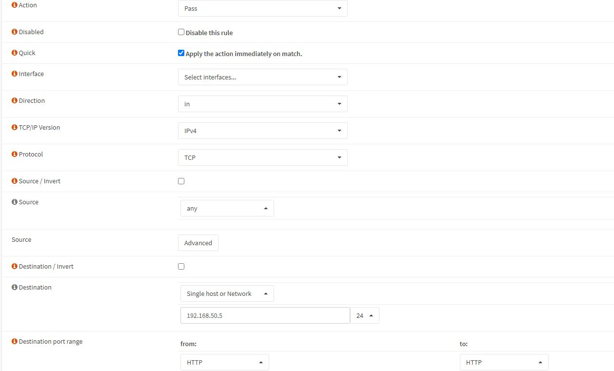

### Introduzione

Solitamente i router e i firewall consentono di eseguire delle operazioni di NAT (Network Address Translation) che permettono di redirigere il traffico generato su un determinato indirizzo IP verso un'altro IP.
Questa soluzione viene spesso utilizzata dagli amministratori di rete quando si verifica la necessità di raggiungere delle macchine e servizi nella rete locale interna sfruttando l'indirizzo pubblico del Router/Firewall fornito dall'ISP.

Tramite il NAT con port forwarding possiamo ad esempio redirigere il traffico generato sulla porta 443 (https) tramite l'indirizzo IP pubblico del Router 100.xx.xx.xx verso l'indirizzo IP locale 192.168.10.3 sulla porta 80. 
In questo modo possiamo mantenere in ascolto il servizio web sulla porta 80 (http) del server locale e raggiungerlo tramite porta 443 (https) e l'indirizzo IP pubblico.

### Informazioni sul setup dell'ambiente

Ai fini della dimostrazione ho impostato un ambiente virtualizzato (tramite VirtualBox) per simulare una rete interna composta da due VM, una macchina Windows 10 (con servizio web in ascolto sulla porta 80)  e un'altra con sistema operativo OpnSense che deve fare da Firewall/Router verso la WAN, che invece corrisponde alla mia rete locale. Questo è lo schema corrispondente.

__Ovviamente il processo di port forwarding rimane analogo nel caso in cui il Firewall OpnSense avesse una interfaccia nella LAN ed una direttamente sulla WAN (Internet).__

### NAT port forwarding con Firewall OpnSense

1. Accedere alla dashboard di opnsense da una macchina nella rete tramite l'indirizzo dell'interfaccia del firewall verso la rete interna https://192.168.50.1

2. Selezionare _Firewall > NAT > Port Forward_

3. Aggiungere una regola

4. Impostare i parametri necessari

- __Interface__: WAN
- __Protocol__: TCP 
- __Destination__: WAN Address (Indirizzo dell'interfaccia del firewall dalla parte della WAN)
- __Destination port range__: 443 (Range di porte da redirezionare, in questo caso una porta)
- __Redirect target IP__: 192.168.50.5 (Indirizzo IP della macchina contenuta nella rete interna verso la quale redirigere il traffico)
- __Redirect target port__: 80 (porta aperta sulla macchina interna verso la quale redirigere il traffico)

5. Salva

Abbiamo completato con successo il NAT con port forwarding, adesso per poter raggiungere il web service dalla WAN dobbiamo aggiungere una __Floating Rule__ nel firewall per consentire al traffico di passare per raggiungere la macchina Server.

### Aggiunta Floating Rule

1. Selezionare _Firewall > Rules > Floating_

3. Aggiungere una nuova _rule_

4. Impostare questi parametri

- __Action__: Pass (Il traffico deve passare)
- __Direction__: In (Ingresso)
- __Protocol__: TCP
- __Source__: Any
- __Destination__: 192.168.50.5 (Indirizzo dell'host di destinazione)
- __Destination port range__: 80 (Porta verso la quale redirigere il traffico)

5. Salvare

### Conclusione

Adesso è tutto completo, possiamo raggiungere il Servizio Web installato nella rete interna utilizzando l'indirizzo IP esterno lato WAN, in questo scenario l'indirizzo ip dell'interfaccia del firewall verso la WAN è 192.168.1.2, quindi il servizio dovrebbe essere disponibile all'URL https://192.168.1.2.
