### Introduzione

VMware è un software HyperVisor che non solo ci consente di creare delle macchine virtuali e installare un loro sistema operativo, ma anche di creare delle reti interne di macchine virtuali, in questo modo le VM nella stessa LAN possono comunicare, mentre quelle in LAN Virtuali diverse possono interagire SOLO attraverso altre VM che fungono da Router (ad esempio macchine con sistema operativo OpnSense).

L'obiettivo è realizzare questo scenario di rete con VMWare.

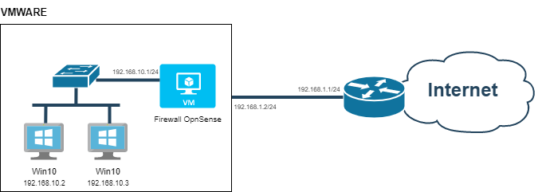

Le macchine all'interno della rete _192.168.10.0_ possono comunicare tra di loro ma non riescono a raggiungere Internet, per questo motivo aggiungiamo un'ulteriore macchina virtuale che funge da Router/Firewall con due NIC, una verso la rete interna e l'altra verso la WAN.
In particolare l'interfaccia esterna deve essere in _bridge_ con l'interfaccia fisica della macchina host.

In questa guida ci limiteremo ad implementare l'infrastruttura in VMWare senza però entrare nel dettaglio della configurazione del firewall o delle singole macchine.

### Requisiti:

- __Una ISO di Windows 10__
- __Una ISO di OpnSense__
- __VMWare Workstation Pro__

### Creazione dell'infrastruttura di rete con VMware Workstation

#### 1. Creazione rete virtuale con indirizzo di rete 192.168.10.0/24.

- Seleziona _Edit_ > _Virtual Network Editor_

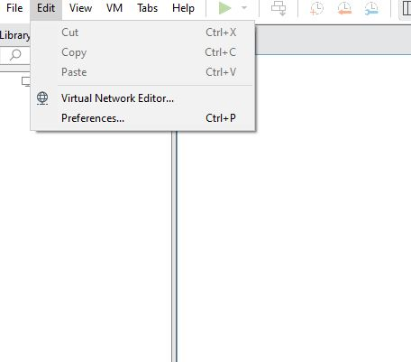

- Seleziona _Add Network_

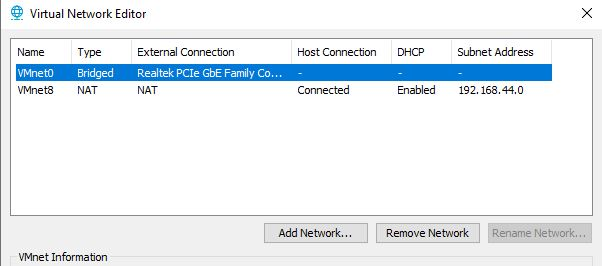

- Seleziona il nome della rete e _OK_

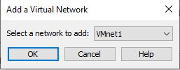

- Seleziona _Host-only_ e imposta indirizzo IP della rete e Subnet Mask

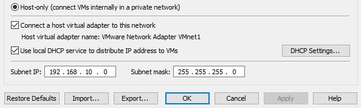

#### 2. Creazione di una VM OpnSense.

La VM OpnSense dovrà avere due interfacce di rete, una connessa allo switch virtuale della rete interna (LAN) ed un'altra in bridge con l'interfaccia fisica dell'host (WAN).

- Seleziona __File > New Virtual Machine__

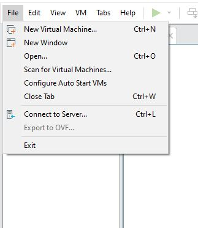

- Seleziona __Installer disc image file (iso)__ e importa la iso di OpnSense

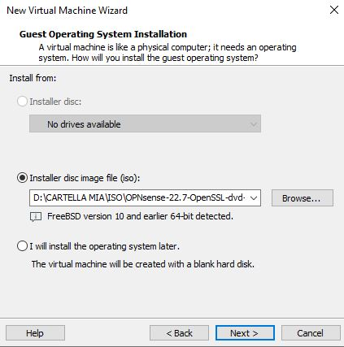

- Definisci il nome e la location dove andare a salvare la VM

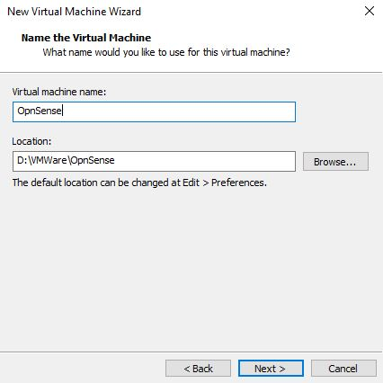

- Definisci la memoria da utilizzare e termina

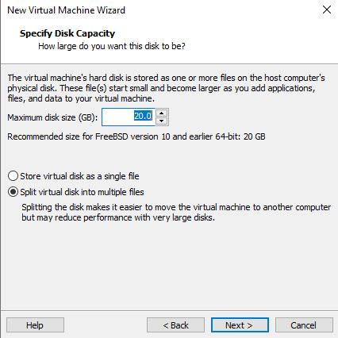

- Incrementa la memoria RAM utilizzabile dalla VM, __tasto destro sulla VM > Settings__

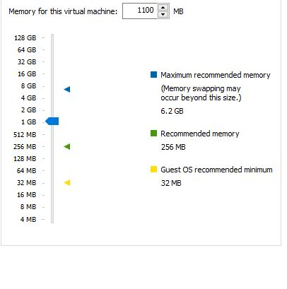
- Imposta l'interfaccia di rete corrispondente alla WAN, seleziona __Network Adapter >_Bridged__

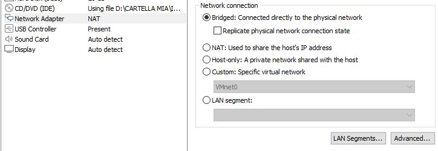

- Aggiungi una interfaccia di rete corrispondente alla LAN interna che abbiamo creato precedentemente, seleziona __Add > Network Adapter > Custom__ e poi seleziona __VMnet1 (Host-only)__

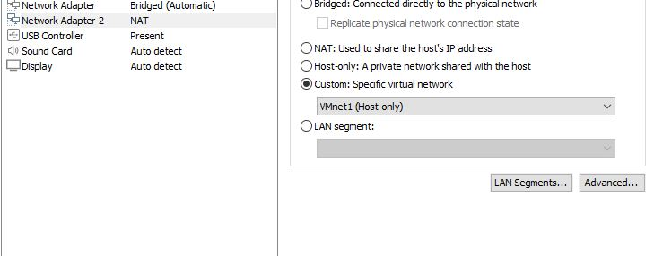

#### 3. Creazione VM Windows 10

Per creare la VM con sistema operativo Windows 10 basta seguire i passaggi precedenti utilizzati per la macchina OpnSense

- La VM in questione necessita di una singola interfaccia di rete impostata su __Custom (VMnet1)__

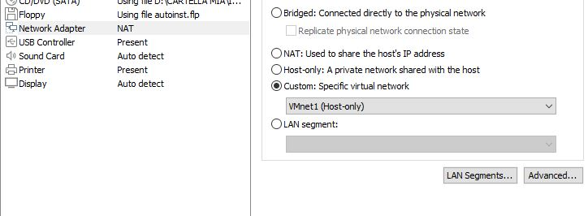

