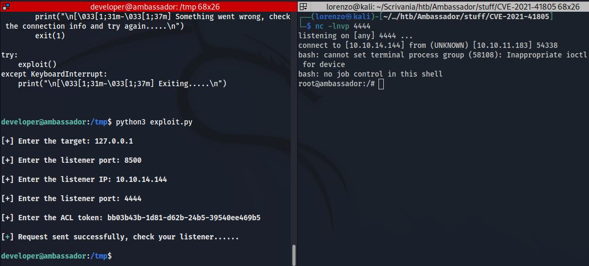

### 1. Scan delle porte per individuare i servizi

- __Porta 22__ (SSH): OpenSSH 8.2p1 Ubuntu 4ubuntu0.5 (Ubuntu Linux; protocol 2.0)
- __Porta 80__ (HTTP): Web Server Apache/2.4.41 (Ubuntu) con CMS Hugo 0.94.2 scritto in Go
- __Porta 3000__ (HTTP): Servizio Grafana per l'analisi di dati geografici 
- __Porta 3306__ (MYSQL): MySql in ascolto sulla porta 3306 che ci consente di agire sul db da remoto

### 2. Exploit Grafana CVE-2021-43798

La versione di Grafana è la _8.2.0_, la quale è vulnerabile ad un attacco di file disclosure.
Un exploit si può facilmente trovare su [github](https://github.com/pedrohavay/exploit-grafana-CVE-2021-43798)

Ho leggermente modificato l'exploit perchè mi dava errori di compatibilità con l'ultima versione di Python, quindi alla fine ho scoperto che il problema era causato dal modulo prompt e quindi ho eliminato ogni suo riferimento.

Come avevamo previsto la versione di grafana installata è vulnerabile e quindi siamo riusciti ad estrarre dal server alcuni file molto interessanti tra cui _passwd_.

Notiamo l'utente _developer_ che ci tornerà utile in seguito.

Tra i file estratti abbiamo anche _grafana.db_ che corrisponde all'intero database di grafana, per estrarre il contenuto di questo database possiamo utilizzare DbBrowser o creare un piccolo script in python molto semplice, io ho optato per la seconda soluzione.

l'output di questo script è:

notiamo la password __dontStandSoCloseToMe63221!__ e l'utente __grafana__.

dopo un po di tentativi ho scoperto che questa combinazione di credenziali consente di loggare sul server __MySql__

### 3. Esplorazione database MySql

Dopo aver fatto l'accesso al database tramite MySql ho notato la presenza del db __whackywidget__, allora sono entrato all'interno ed ho estratto tutto il contenuto della table users che conteneva lo username _developer_ ed una password codificata in base64.
_developer_:_anEnglishManInNewYork027468_

Adesso possiamo conquistare la user.txt flag accedendo da remoto tramite SSH con utente _developer_

### 4. Privilege escalation

Dopo un bel po' di enumerazione ho trovato due servizi molto interessanti nella directory _/opt_

- __my-app__: Applicazione Django (Python) con _.git_
- __consul__: API che consente di gestire la comunicazione tra più servizi in sicurezza. 

my-app corrisponde ad una repo github, allora ho sfruttato il software git sulla macchina remota per visualizzare gli ultimi commit.

Adesso possiamo analizzare l'ultimo commit generato

Notiamo la rimozione di una riga che mostra un token di sicurezza utilizzato corrispondente all'applicazione Django che ci tornerà utile in seguito

- __TOKEN__: bb03b43b-1d81-d62b-24b5-39540ee469b5

tramite il comando _netstat -l_ ho notato la presenza della porta 8500 in ascolto su localhost e solitamente si riferisce al servizio Consul. 
Dopo un po' di ricerche ho scoperto la [__CVE-2021-41805__](https://github.com/I-Am-Nelson/CVE-2021-41805) che coinvolge _Consul_ e consente di eseguire una Privilege Escalation.

Allora eseguendo l'exploit sulla macchina remota e mettendoci in ascolto sulla porta 4444 della macchina locale possiamo ottenere una shell con privilegi di root.

