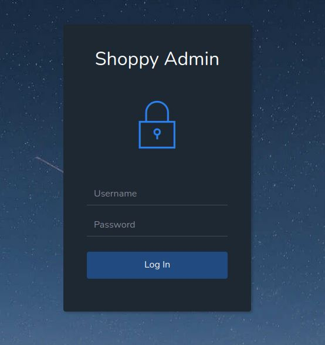
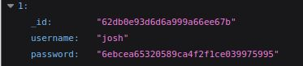

### 1. Scan delle porte


- __Porta 80__ (HTTP): WebServer Nginx 1.23.1 che ospita una web application
- __Porta 22__ (SSH): Protocollo di accesso remoto alle macchine

### 2. Enumerazione degli endpoint con GoBuster


Gli endpoint più interessanti sono:
- http://shoppy.htb/login (200 status code)
- http://shoppy.htb/admin (302 status code)

### 3. Web Enumeration e NoSQLInjection

Con l'URL __http:\/\/shoppy.htb\/login__ viene mostrato questo form di login:




In seguito al click sul pulsante __Log In__ viene generata una richiesta di POST con parametri username e password.

Dopo un po' di ricerche ho scoperto che probabilmente dietro all'applicazione c'è un database NoSql (La mia Guess è MongoDB)

- NoSQL injection authentication bypass per loggare come utente __admin__:


La dashboard minimale che ci si presenta consente di ricercare gli users e ottenere il loro id, username e password hash, allora ho pensato che anche su quel campo ci potesse essere una NoSql injection, ed è stato così:


L'export contiene informazioni riguardo un altro utente, _josh_:



l'hash è nel formato MD5 ed è facilmente craccabile da un qualsiasi servizio online, la password in chiaro è __remembermethisway__.

### 4. Enumerazione SubDomain

```bash
wfuzz -u http://10.10.11.180 -H 'Host: FUZZ.shoppy.htb' -w /usr/share/wordlists/amass/bitquark_subdomains_top100K.txt --sc 200
```

__wfuzz__ ha ritornato status 200 su questo dominio:
- _mattermost.shoppy.htb_

Su questo dominio è presente il servizio __mattermost__, ho eseguito il login con le credenziali di josh e in uno dei canali sono presenti, come messaggio di jaeger, le sue credenziali:


A questo punto ho potuto loggare come utente _jaeger_ tramite protocollo SSH

### 5. Privilege Escalation Orizzontale


L'utente _jaeger_ ha la possibilità di eseguire /home/deploy/password-manager con i privilegi dell'utente _deploy_,  il software chiede una password per leggere il contenuto del file creds.txt, allora facendo reverse engineering dell'ELF ho scoperto che la password è hardcoded ed è __Sample__ e il file contiene la password dell'utente _deploy_


### 6. Privilege Escalation Docker exploit


L'utente _deploy_ appartiene al gruppo _docker_ e infatti può eseguire comandi docker per creare container.
Allora creiamo un container con immagine _alpine_ e condividiamo la directory __\/mnt__ del container con la root directory della macchina host __\/__, in questo modo possiamo ottenere una shell con privilegi di root nel container e navigando __\/mnt__ abbiamo accesso privilegiato al file system della macchina.

