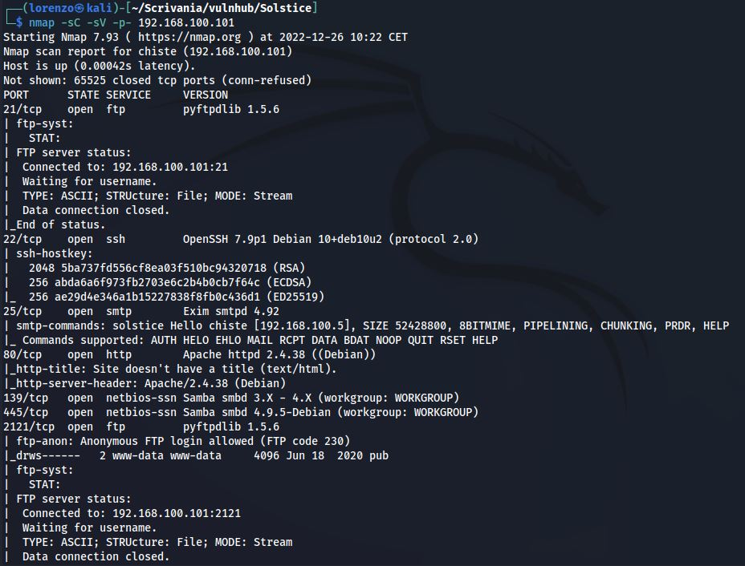
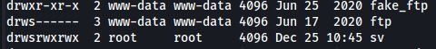

### 1. Scan delle porte

```bash
nmap -sC -sV -p- 192.168.100.101
```




- __PORTA 21__ (FTP): FTP pyftpdlib 1.5.6
- __PORTA 22__ (SSH): OpenSSH 7.9p1 Debian 10+deb10u2 (protocol 2.0)
- __PORTA 25__ (SMTP): Exim smtpd 4.92 (Servizio per le email)
- __PORTA 80__ (HTTP): Web Server Apache httpd 2.4.38 (Debian)
- __PORTA 139/445__ (SMB): File Server SMB
- __PORTA 2121__ (FTP): FTP pyftpdlib 1.5.6 con accesso __anonymous__
- __PORTA 3128__ (SQUID PROXY): Proxy Server Squid version 4.6
- __PORTA 8593__ (PHP): Web Server PHP
- __PORTA 54787__ (PHP): Web Server PHP

### 2. Enumerazione servizio web sulla porta 54787

Prima di tutto ho effettuato una scansione delle directory tramite wfuzz

```bash
wfuzz -w /usr/share/wordlists/dirbuster/directory-list-2.3-medium.txt -u http://192.168.100.101:54787/FUZZ --hh 0
```


Visto che ogni directory testata (anche non esistente) ritorna status code 200, ho utilizzato il parametro __--hh 0__ per nascondere tutte le risposte composte da 0 caratteri.

- __/project/__: Su questo Endpoint è presente il servizio __File Thingie 2.5.7__ che è un semplice web file storage scritto in PHP.


Inizialmente ci viene chiesto di effettuare il login e dopo un po' di tentativi sono riuscito ad accedere con queste credenziali:
- username: admin
- password: admin

### Exploit File Thingie Arbitrary File Upload 

Questa versione di File Thingie è vulnerabile ad [Arbitrary File Upload](https://www.exploit-db.com/exploits/47349) e questo ci consente di importare uno script php che ci invia una [reverse shell](https://github.com/pentestmonkey/php-reverse-shell/blob/master/php-reverse-shell.php) sulla macchina server remota. 

- Dobbiamo modificare la variabile _ip_ inserendo l'ip della nostra macchina e assegniamo alla variabile _port_ il valore della porta in ascolto sulla nostra macchina, sulla quale otterremo la reverse shell:


L'applicativo ci vieta di fare l'upload di file con estenzione __.php__, quindi per sfruttare questa vulnerabilità visogna fare così:

1) Creare un file ZIP che contiene il file __.php__ che vogliamo eseguire da remoto

```bash
zip -q exploit.zip phprevshell.php
```

2) Fare l'upload del file zip tramite l'applicazione web


3) Estrarre il contenuto del file zip


Siamo riusciti ad estrarre la nostra reverse shell sul server e abbiamo anche bypassato la restrizione che ci impediva di caricare direttamente il file php.

Mettiamoci in ascolto:


I file che carichiamo si trovano nella directory __/project__ quindi possiamo triggherare la reverse shell in questo modo:

```bash
http://192.168.100.101:54787/project/phprevshell.php
```

BOOM! adesso abbiamo una shell sulla macchina.

### Privilege Escalation

Dopo un bel po' di enumerazione e ricerche ho scoperto un servizio sulla porta 57 esposto SOLO in localhost e quindi non rilevabile tramite la scansione di __nmap__ che abbiamo fatto all'inizio.

```bash
netstat -tunl
```


Per avere maggiori informazioni riguardo questo servizio ho visualizzato tutti i processi eseguiti da __root__ e il comando che li ha generati.

```bash
ps aux
```


In questo modo abbiamo scoperto che si tratta di un web service php che si trova in __/var/tmp/sv__



Notiamo anche che questa directory ha il bit __SUID__ attivo e chiunque può leggere e scrivere all'interno, in più all'interno della directory è presente un file index.php che possiamo modificare ed è posseduto da root.
Adesso la privilege escalation diventa un gioco da ragazzi.

Inseriamo questo codice php all'interno del file index.php in modo tale da aggiungere l'SUID sul binary _/usr/bin/bash_, in questo modo possiamo ottenere una shell con i privilegi di colui che possiedere il file, in questo caso __root__

```php
<?php system('chmod u+s /usr/bin/bash') ?>
```


SIAMO ROOT!!

